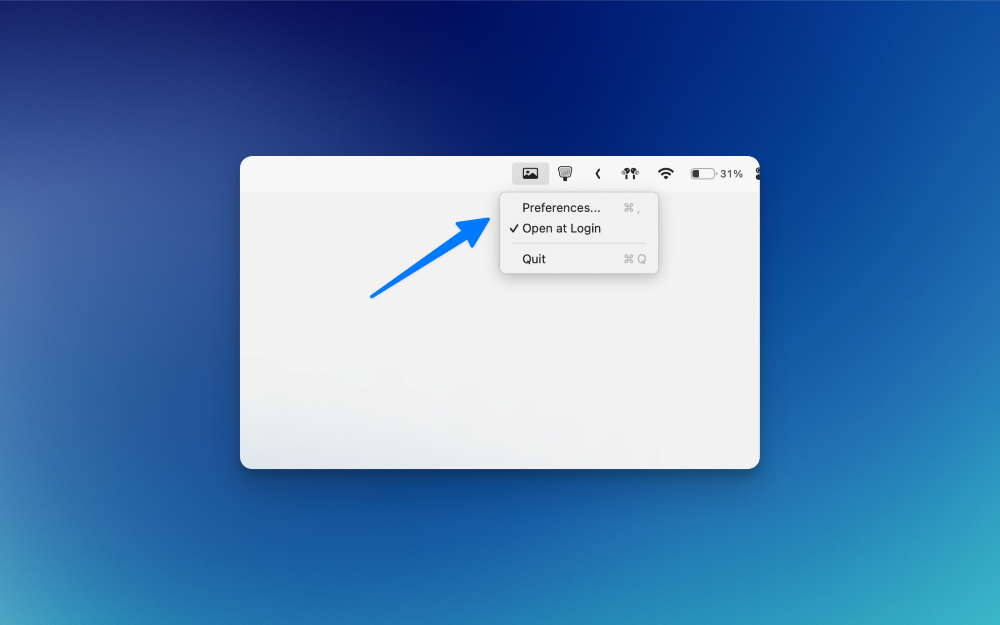
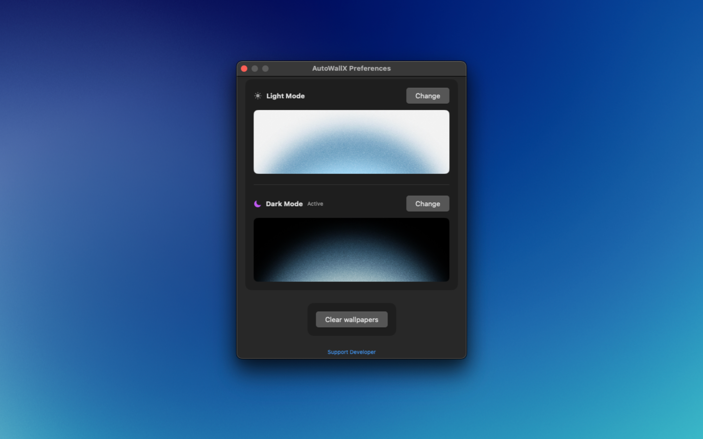

# ThemedMac
A mac app to switch wallpapers according to the appearance of the mac (dark mode and light mode)

The app has a very simple functionality. It allows you to pick two separate wallpapers for light and dark mode. Then it runs in the background as a menu app. You can enable "Open at login" to ensure the app is always there. 

It also works with scheduled light/dark mode of your system.

If you want to change your chosen wallpaper, just click on "Reset All" at the bottom of the Preferences page which you can access via menu options.

If you have any suggestions, let me know. Contact details on my profile.

